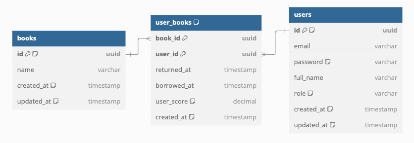

## Library Management API


## Installation and Running the app

#### 1. Clone the repository
#### 2. Copy the .env.local file to .env
```bash
cp .env.local .env
```
#### 3. Run docker compose for database
```bash
docker-compose up -d
```

#### 4. Initialize and run the tests
*Tests will run with the `.env.test` environment file.*
```bash
npm install && npm run migration:seed && npm run test
```

#### 5. Run the application
```bash
npm run start
```
App will be running on <a href="http://localhost:3000" target="_blank">http://localhost:3000</a> by default.

### Default Users
| User | Email                 | Password(*decoded*)  | Full Name      | Admin  |
|------|-----------------------|----------------------|----------------|--------|
| #1   | darthvader@mail.com   | password             | Darth Vader    | true   |
| #2   | obiwankenobi@mail.com | password             | Obi-Wan Kenobi | false  |
| #3   | quigonjinn@mail.com   | password             | Qui-Gon Jinn   | false  |

---

### Database Diagram

---
### API Documentation
**[--> Postman collection with example responses](Library%20API%20Collection.postman_collection.json)**

### Response Types

```
# General Succeed Response
{
    "data": {...},
    "error": null
}

# Paginated Response
{
    "data": {
        "results": [...],
        "total": 100,
    },
    "error": null
}
```

```
# General Error Response
{
    "data": null,
    "error": {
        "status": 400,
        "name": "Error constructor name",
        "message": "Error message",
        "timestamp": 1708259049433
    }
}

# Validation Error Response
{
    "data": null,
    "error": {
        "status": 400,
        "name": "ValidationException",
        "message": "Validation Failed",
        "errors": [
            {
                "field": "field_name",
                "message": "Error message"
            }
        ],
        "timestamp": 1708259049433
    }
}
```

---
### Endpoints
#### Using Pagination:

>  **limit**: must be a number \
>  **offset**: must be a number \
>  **order**: 'asc' or 'desc' \
>  **orderBy**: keyof Entity \
>  Example: `[GET] /book?limit=10&offset=0&orderBy=name&order=ASC`

#### Authentication
`[GET] /auth/me`: Returns the current user's information. [Requires Authentication]

`[POST] /auth/sign-up`: Register a new user [Public]
> `user` role is assigned by default.

`[POST] /auth/sign-in`: Login a user [Public]
#### User [Required Roles: `admin`]
`[POST] /users`: Create a new user.

`[GET] /users`: Returns a paginated list of users.

`[GET] /users/:userId`: Returns a user with borrow history.

`[POST] /users/:userId/borrow/:bookId`: Records a new book borrowing by the user for the specified book.

`[POST] /users/:userId/return/:bookId`: Records the return of a borrowed book for the user, marking the book as returned.
`{score: 0-10}` must be provided in Request Body.

#### Book
`[POST] /books`: Create a new book. [Required Roles: `admin`]

`[GET] /books`: Returns a paginated list of books. (with 5s cache)
> Query Params:
> * keyword: Search by book name

`[GET] /books/:bookId`: Returns a book with average score.
